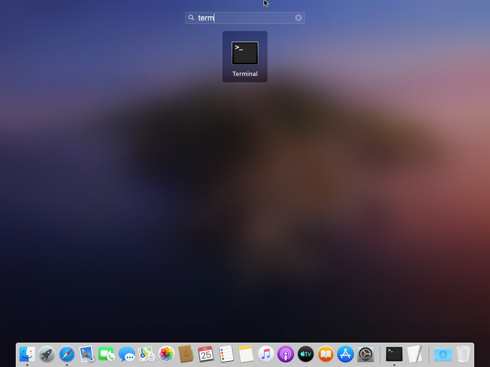

# mactag

Script to read tags from an excel file and apply them to listed files


## Instructies (nl)

1. Eerst moeten er bepaalde componenten geïnstalleerd worden, open de LaunchPad en start een terminal:



2. Kopiëer onderstaand commando en plak het in de terminal, druk daarna op enter:


```
curl https://bootstrap.pypa.io/get-pip.py -o get-pip.py
```

Als je je eigen username onderaan terug ziet verschijnen gevolgd door @localhost dan is het commando klaar en kan je naar de volgende stap.

3. 