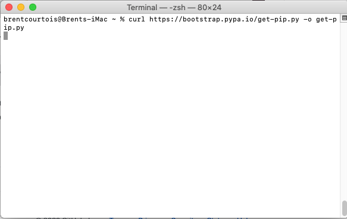
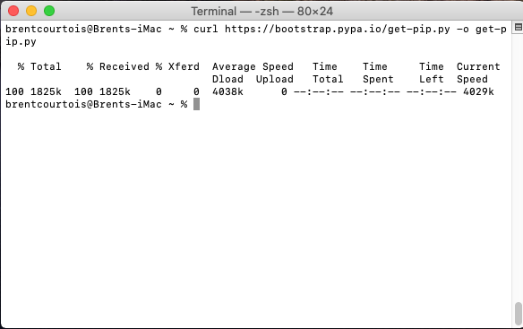

# mactag

Script om tags van een excel bestand te lezen en toe te passen op de gegeven bestanden.


## Installeren

Deze stappen dienen eenmalig uitgevoerd te worden:

1. Download het script: 

Rechts op de pagina staan de releases. Klik op de meest recente release! Op dit moment is dat 1.0.0:


Download dan `mactag.command` door er op te klikken. Het script zal dan in je downloads folder terecht komen, laat deze voorlopig staan.


2. Eerst moeten er bepaalde componenten geïnstalleerd worden, open de LaunchPad en start een terminal:


3. Kopiëer onderstaand commando en plak het in de terminal, druk daarna op enter:


```
curl https://bootstrap.pypa.io/get-pip.py -o get-pip.py
```



Als je je eigen username onderaan terug ziet verschijnen dan is het commando klaar en kan je naar de volgende stap.



4. Voer ook volgende commando's uit om pip te installeren:

```
python get-pip.py
```

```
export PATH=$PATH:~/Library/Python/2.7/bin
```

5. Nu kan pip gebruikt worden om openpyxl en xattr te installeren:

```
pip install openpyxl
```

```
pip install xattr
```


6. Nu enkel nog de permissies goedzetten voor het script:

```
chmod 755 ~/Downloads/mactag.command
```

Voila, mactag is geïnstalleerd. Je kan nu het script verplaatsen naar de folder waar de bestanden die getagged moeten worden zich bevinden, alsook het excel bestand.


## Gebruik